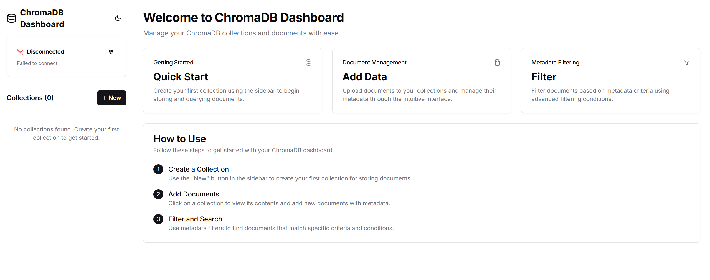

<h1 align="center">ChromaDB Dashboard</h1>



<p align="center">
  <strong>A modern and intuitive visual management panel for ChromaDB.</strong>
</p>

<p align="center">
  
  
  
</p>
<p align="center">
  
  
  
  
  
</p>

---

ChromaDB Dashboard provides a beautiful and user-friendly interface for interacting with your ChromaDB instances. Built with a modern tech stack, it simplifies collection and document management, metadata filtering, and more.

## ✨ Key Features

- **Modern UI**: A fluid and responsive design built with Next.js 14 and Tailwind CSS.
- **Collection Management**: Easily create, view, and delete collections.
- **Document Handling**: Add, inspect, and delete documents with metadata.
- **Metadata Filtering**: Filter your documents by their metadata.
- **Real-time Insights**: Live connection status and automatic data refresh.
- **Theme Toggling**: Switch between light and dark modes to suit your preference.

## 🛠️ Tech Stack

- **Frontend**: [Next.js](https://nextjs.org/) 14, [TypeScript](https://www.typescriptlang.org/), [Tailwind CSS](https://tailwindcss.com/)
- **Backend**: [Python](https://www.python.org/) with [FastAPI](https://fastapi.tiangolo.com/)
- **UI Components**: [Shadcn/ui](https://ui.shadcn.com/)
- **Database**: [ChromaDB](https://www.trychroma.com/)

## 🚀 Quick Start

### Prerequisites

- [Node.js](https://nodejs.org/en/) v18+
- [Python](https://www.python.org/) 3.8+
- A running instance of [ChromaDB](https://www.trychroma.com/).

> **Tip**: To start a local ChromaDB server, run:
> `pip install chromadb`
> `chroma run --host localhost --port 8001`

### Installation and Launch

We provide a one-click setup script to simplify the process.

```bash
# 1. Clone the repository
git clone https://github.com/oGYCo/ChromaDB-Dashboard.git
cd ChromaDB-Dashboard

# 2. Run the setup script
# This will install both frontend and backend dependencies
./setup.sh

# 3. Start the application (in two separate terminals)

# Start the backend (in the backend/ directory)
cd backend
source venv/Scripts/activate  # On Unix/macOS, use: source venv/bin/activate
uvicorn main:app --reload --port 8080

# Start the frontend (in the frontend/ directory)
cd frontend
npm run dev
```

Once the application is running, open `http://localhost:3000` in your browser to access the dashboard.

## 🤝 Contributing

Contributions of all forms are welcome! If you have ideas, suggestions, or bug fixes, feel free to open an issue or submit a pull request.

## 📄 License

This project is licensed under the [MIT License](LICENSE).
