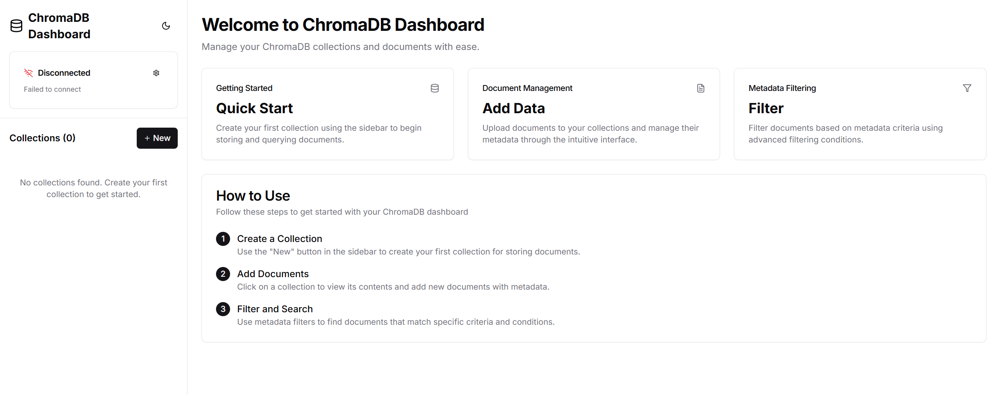

<h1 align="center">ChromaDB Dashboard</h1>



<p align="center">
  <strong>一个为 ChromaDB 设计的现代化、直观的可视化管理面板。</strong>
</p>

<p align="center">
  
  
  
</p>
<p align="center">
  
  
  
  
  
</p>

---

ChromaDB 仪表板提供了一个美观且用户友好的界面，用于与您的 ChromaDB 实例进行交互。它采用现代技术栈构建，简化了集合和文档管理、向量搜索等操作。

## ✨ 主要功能

- **现代化用户界面**: 使用 Next.js 14 和 Tailwind CSS 构建的流畅响应式设计。
- **集合管理**: 轻松创建、查看和删除集合。
- **文档处理**: 添加、检查和删除带有元数据的文档。
- **元数据过滤**: 通过元数据过滤您的数据文档。
- **实时洞察**: 实时连接状态和自动数据刷新。
- **主题切换**: 根据您的喜好在亮色和暗色模式之间切换。

## 🛠️ 技术栈

- **前端**: [Next.js](https://nextjs.org/) 14, [TypeScript](https://www.typescriptlang.org/), [Tailwind CSS](https://tailwindcss.com/)
- **后端**: [Python](https://www.python.org/) with [FastAPI](https://fastapi.tiangolo.com/)
- **UI 组件**: [Shadcn/ui](https://ui.shadcn.com/)
- **数据库**: [ChromaDB](https://www.trychroma.com/)

## 🚀 快速开始

### 环境要求

- [Node.js](https://nodejs.org/en/) v18+
- [Python](https://www.python.org/) 3.8+
- 一个正在运行的 [ChromaDB](https://www.trychroma.com/) 实例。

> **提示**: 要启动本地 ChromaDB 服务器，请运行：
> `pip install chromadb`
> `chroma run --host localhost --port 8001`

### 安装与启动

我们提供了一个一键安装脚本来简化设置过程。

```bash
# 1. 克隆仓库
git clone https://github.com/oGYCo/ChromaDB-Dashboard.git
cd ChromaDB-Dashboard

# 2. 运行安装脚本
# 这将安装前端和后端的依赖项
./setup.sh

# 3. 启动应用 (在两个不同的终端中)

# 启动后端 (在 backend/ 目录)
cd backend
source venv/Scripts/activate  # Windows (Git Bash): source venv/Scripts/activate
uvicorn main:app --reload --port 8080

# 启动前端 (在 frontend/ 目录)
cd frontend
npm run dev
```

应用启动后，在浏览器中打开 `http://localhost:3000` 即可访问仪表板。

## 🤝 贡献

欢迎各种形式的贡献！如果您有任何想法、建议或错误修复，请随时提出 Issue 或提交 Pull Request。

## 📄 许可证

该项目根据 [MIT 许可证](LICENSE) 授权。